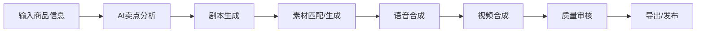

# VidMuse

> 🚀 **面向TikTok Shop商家的AIGC视频生成平台**，输入商品信息，自动完成素材匹配、剧本创作到视频合成，15秒生成一条高质量带货视频。

## ✨ 核心特性

- **⚡ 极速生成**：15秒完成从商品信息到成品视频的全流程
- **🧠 智能创作**：AI自动生成带货剧本，匹配商品卖点和用户痛点
- **🎬 自动剪辑**：智能素材匹配、 transitions 效果、字幕生成、语音合成
- **🎨 多风格支持**：支持多种视频风格、口播风格、背景音乐选择
- **📊 效果优化**：基于爆款视频模板优化生成策略，提升转化率
- **🔌 一键发布**：支持直接推送至TikTok Shop等多个平台
- **📦 开箱即用**：Docker一键部署，无需复杂配置

## ✨ 演示视频
地址：https://www.bilibili.com/video/BV1VSEX6sEHd/?vd_source=aa35b545c15d70279dc1dc07445002ff

## 🏗️ 技术架构

### 技术栈

| 层级       | 技术选型                                                                 |
|------------|--------------------------------------------------------------------------|
| **前端**   | React 19 + Vite + Tailwind CSS + Ant Design + Zustand                    |
| **后端**   | Python 3.14 + FastAPI + Uvicorn + Celery                                  |
| **数据库** | MySQL 8.0 + SQLAlchemy + Redis                                            |
| **存储**   | MinIO 对象存储（支持火山引擎TOS兼容）                                     |
| **AI能力** | 火山引擎豆包大模型 + Embedding + 图像生成 + 语音合成 + Qdrant向量数据库   |
| **多媒体** | FFmpeg + OpenCV + Pydub                                                   |
| **部署**   | Docker + Docker Compose + Nginx                                           |

### 系统架构

```
┌─────────────────┐     ┌─────────────────┐     ┌─────────────────┐
│   前端Web界面   │────▶│   后端API服务   │────▶│   任务调度层    │
└─────────────────┘     └─────────────────┘     └─────────────────┘
                                                         │
                                                         ▼
┌─────────────────┐     ┌─────────────────┐     ┌─────────────────┐
│  向量数据库     │◀────│   AI大模型      │◀────│   异步任务队列  │
│  (Qdrant)       │     │  (火山引擎)     │     │   (Celery)      │
└─────────────────┘     └─────────────────┘     └─────────────────┘
                                                         │
                                                         ▼
┌─────────────────┐     ┌─────────────────┐     ┌─────────────────┐
│  对象存储       │◀────│   视频合成      │◀────│   素材处理      │
│  (MinIO/TOS)    │     │   (FFmpeg)      │     │   (OpenCV)      │
└─────────────────┘     └─────────────────┘     └─────────────────┘
```

## 🚀 快速开始

### 环境要求

- Docker 20.10+
- Docker Compose v2+
- 推荐配置：16GB RAM + 4核CPU + GPU（可选，用于加速视频生成）
- 火山引擎API密钥（用于大模型、Embedding、语音合成等服务）

### 一键部署

1. **克隆项目**
   ```bash
   git clone https://github.com/D884565/VidMuse.git
   cd VidMuse
   ```

2. **配置环境变量**
   ```bash
   # 复制并编辑.env文件
   cp .env.example .env
   ```
   
   重点配置以下参数：
   ```env
   # 火山引擎API配置
   DOUBAO_SEED_API_KEY=your_doubao_api_key
   VOLC_EMBEDDING_API_KEY=your_embedding_api_key
   IMAGE_API_KEY=your_image_api_key
   TTS_ACCESS_KEY=your_tts_access_key
   TTS_SECRET_KEY=your_tts_secret_key
   
   # 存储配置（可选，默认使用MinIO）
   STORAGE_TYPE=tos  # 或 minio
   TOS_ACCESS_KEY=your_tos_access_key
   TOS_SECRET_KEY=your_tos_secret_key
   ```

3. **启动服务**
   ```bash
   docker-compose up -d
   ```

4. **访问系统**
   - 前端界面：http://localhost:5173
   - 后端API文档：http://localhost:8000/docs
   - MinIO控制台：http://localhost:9001 (账号: minioadmin / 密码: minioadmin)

### 本地开发

#### 后端开发

1. **创建Python虚拟环境**
   ```bash
   python -m venv .venv
   source .venv/bin/activate  # Windows: .venv\Scripts\activate
   ```

2. **安装依赖**
   ```bash
   pip install -r requirements.txt
   ```

3. **启动基础服务（MySQL、Redis、MinIO、Qdrant）**
   ```bash
   docker-compose up -d mysql redis minio qdrant
   ```

4. **启动后端服务**
   ```bash
   cd backend/v1
   python main.py
   ```

5. **启动Celery worker（处理异步任务）**
   ```bash
   celery -A backend.v1.app.generate.tasks.celery_app.celery_app worker --loglevel=info --concurrency=2
   ```

#### 前端开发

1. **进入前端目录**
   ```bash
   cd frontend
   ```

2. **安装依赖**
   ```bash
   npm install
   ```

3. **启动开发服务器**
   ```bash
   npm run dev
   ```

## 📦 功能说明

### 核心功能模块

| 模块         | 功能描述                                                                 |
|--------------|--------------------------------------------------------------------------|
| **商品管理** | 支持导入TikTok Shop商品、手动录入商品信息、商品卖点分析                  |
| **剧本生成** | AI根据商品信息自动生成带货剧本，支持多风格选择、人工编辑调整              |
| **素材管理** | 自动素材搜索、上传管理、标签化存储、智能匹配                              |
| **视频合成** | 自动剪辑、字幕生成、语音合成、背景音乐、转场效果、滤镜优化                |
| **模板市场** | 提供多种爆款视频模板，支持自定义模板                                      |
| **批量生成** | 支持商品批量导入，一键生成批量视频                                        |
| **发布管理** | 支持直接推送至TikTok Shop，查看发布状态、数据统计                          |
| **数据统计** | 视频播放量、转化率、点击率等数据分析                                      |

### 生成流程



## 📁 目录结构

```
VidMuse
├── backend/                 # 后端代码
│   └── v1/
│       ├── app/
│       │   ├── admin/       # 后台管理模块
│       │   ├── agent/       # AI代理模块
│       │   ├── assets/      # 静态资源
│       │   ├── common/      # 公共工具
│       │   ├── config/      # 配置文件
│       │   ├── generate/    # 视频生成核心模块
│       │   ├── merge/       # 视频合并模块
│       │   ├── models/      # 数据模型
│       │   ├── pipeline/    # 流程编排
│       │   ├── product/     # 商品管理模块
│       │   ├── push/        # 发布推送模块
│       │   ├── script/      # 剧本生成模块
│       │   ├── search/      # 搜索模块
│       │   ├── slice/       # 素材切片模块
│       │   ├── task_scheduler/ # 任务调度
│       │   ├── user/        # 用户模块
│       │   └── video/       # 视频处理模块
│       └── main.py          # 项目入口
├── frontend/                # 前端代码
│   ├── src/
│   │   ├── components/      # 公共组件
│   │   ├── pages/           # 页面组件
│   │   ├── store/           # 状态管理
│   │   ├── utils/           # 工具函数
│   │   └── App.jsx          # 应用入口
│   └── package.json
├── docs/                    # 文档
├── init-scripts/            # 数据库初始化脚本
├── resources/               # 公共资源
├── scripts/                 # 工具脚本
├── docker-compose.yml       # Docker部署配置
├── requirements.txt         # Python依赖
└── README.md                # 项目说明
```

## ⚙️ 配置说明

### 主要配置项

| 配置项                  | 说明                                                                 | 默认值                     |
|-------------------------|----------------------------------------------------------------------|----------------------------|
| `APP_ENV`               | 运行环境（development/production）                                   | development                |
| `MYSQL_*`               | MySQL数据库配置                                                      | 见docker-compose.yml       |
| `REDIS_*`               | Redis配置                                                           | 见docker-compose.yml       |
| `MINIO_*`               | MinIO对象存储配置                                                    | 见docker-compose.yml       |
| `QDRANT_*`              | Qdrant向量数据库配置                                                 | 见docker-compose.yml       |
| `DOUBAO_*`              | 火山引擎豆包大模型配置                                               | 需自行配置                 |
| `VOLC_*`                | 火山引擎Embedding、图像生成配置                                      | 需自行配置                 |
| `TTS_*`                 | 语音合成配置                                                         | 需自行配置                 |
| `STORAGE_TYPE`          | 存储类型（minio/tos）                                                | minio                      |
| `TOS_*`                 | 火山引擎TOS对象存储配置（当STORAGE_TYPE=tos时生效）                   | 需自行配置                 |
| `FFMPEG_PATH`           | FFmpeg可执行文件路径                                                 | 系统自动识别               |

## 👨‍💻 开发指南

### 新增功能模块

1. 在`backend/v1/app/`下创建新的模块目录
2. 实现路由、服务、数据模型
3. 在`main.py`中注册路由
4. 前端对应新增页面和API调用

### 自定义视频模板

1. 在`resources/templates/`目录下新增模板配置
2. 定义模板的结构、素材要求、转场效果等
3. 在模板管理界面导入新模板

### API文档

启动后端服务后访问：http://localhost:8000/docs 查看完整的API文档和调试界面。

## 🚢 部署说明

### 生产环境部署

1. **配置HTTPS**
   - 修改`nginx.conf`配置SSL证书
   - 建议使用Let's Encrypt免费证书

2. **性能优化**
   - 增加Celery worker数量：`CELERY_WORKER_CONCURRENCY=8`
   - 配置GPU加速：取消docker-compose.yml中celery_worker的GPU配置注释
   - 使用对象存储CDN加速静态资源访问

3. **监控告警**
   - 配置Prometheus + Grafana监控服务状态
   - 配置日志收集和告警规则

### 环境变量优化

生产环境建议将敏感配置（API密钥、数据库密码等）通过Docker Secrets或Kubernetes Secrets管理，避免硬编码。

## ❓ 常见问题

### Q: 视频生成速度慢怎么办？
A: 
1. 增加Celery worker并发数
2. 配置GPU加速视频合成
3. 使用更高配置的服务器
4. 优化素材库，减少素材搜索时间

### Q: 如何添加自定义的语音合成服务？
A: 在`backend/v1/app/common/tts/`目录下新增对应的TTS服务实现类，继承基类并实现接口即可。

### Q: 支持其他电商平台吗？
A: 当前版本主要支持TikTok Shop，可通过扩展`product`模块适配其他平台的商品导入。

### Q: 生成的视频质量不好怎么办？
A: 
1. 优化商品信息描述，提供更详细的卖点
2. 选择合适的视频模板和风格
3. 上传更优质的商品素材
4. 人工调整生成的剧本和剪辑参数

## 📄 许可证

MIT License - 详见 [LICENSE](LICENSE) 文件

## 🤝 贡献

欢迎提交Issue和Pull Request！

## 📞 技术支持

如有问题，请通过以下方式联系：
- 提交GitHub Issue
- 发送邮件至：19970772131@163.com

---

**⭐ 如果这个项目对您有帮助，欢迎点个Star支持我们！**
